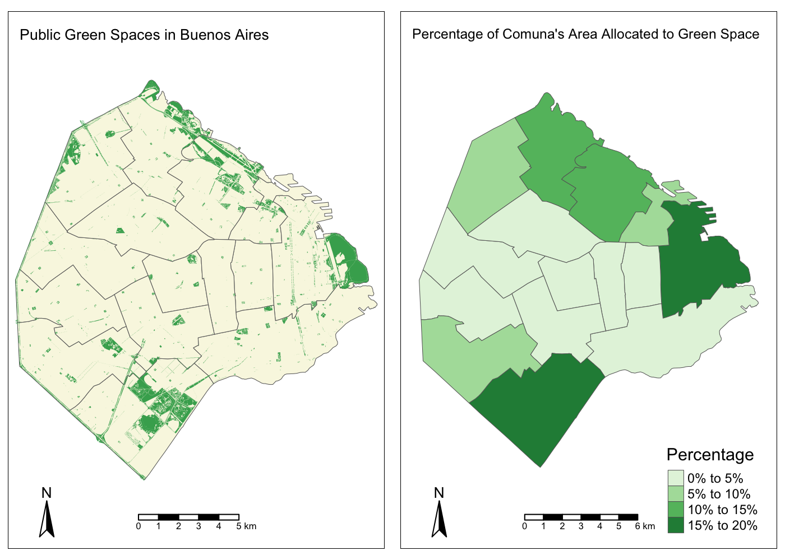

(word count without references and code: 580)

## Maps produced

For this first assignment, I produced two maps for the autonomous city of Buenos Aires (CABA). 
The first map, produced with R, shows Buenos Aires' public green spaces and its comunas (boroughs) categorized by the percentage of the comunas' area allocated to public green spaces.
The second map, produced with QGIS, shows the autonomous city of Buenos Aires split into its [census radii](https://www.indec.gov.ar/codgeo.asp) and categorized by the percentage of the population in each radius that has at least one [unsatisfied basic need](https://www.indec.gob.ar/nivel4_default.asp?id_tema_1=4&id_tema_2=27&id_tema_3=66).

# Public Green Spaces in Buenos Aires

## Data

The data for the geography of Buenos Aires comunas (boroughs) was obtained from the [Argentine Open Data Portal](http://datos.gob.ar). The specific dataset I used is [Unidades Territoriales](http://datos.gob.ar/dataset/ign-unidades-territoriales), which is maintained by the [Argentine National Geographic Institute](http://ign.gob.ar).

The data on public green spaces was obtained from the [Buenos Aires Open Data Portal](https://data.buenosaires.gob.ar/dataset/espacios-verdes). The dataset is updated every month.

## Methodology

I used R for the production of thip map. I found R's documentation to be particularly helpful, and I appreciated the ability to browse through the different functions and parameters. Adjusting settings to achieve my desired results was an intuitive process in which I was able to experiment extensively.
Cleaning and organising my data was not only straightforward but also very fast. Methods like `st_area` and `st_intersection` allowed me to easily calculate the percentages I was interested in.
On the other hand, the aesthetic aspect of my map was the more challenging piece of working with R. Adding labels, modifying the styles of the legends, and modifying the layout of my map required going through the documentation multiple times before achieving a decent looking map.

## Next steps and shortcomings

To extend this map, it would be interesting to look not only at the percentage of green space in the comunas, but also at the population of each comuna, the population density, and the distance to public parks. In addition, the dataset used for this map only accounts for public green spaces, without considering trees or private parks.

## R code and Final Map


```r
# load and filter data
departamentos <- geojson_read("data/departamento.geojson", what="sp")

comunasBASP <- departamentos[grep("^02",departamentos@data$IN1),]
comunasBASF <- st_as_sf(comunasBASP)
comunasBASF <- comunasBASF[,c(1,5,6)]
colnames(comunasBASF) <- c("Nombre de Comuna", "ID", "geometry")
comunasBASF$area <- st_area(comunasBASF)

espaciosVerdes <- read.csv("data/espacio-verde-publico.csv")
espaciosVerdesSF <- st_as_sf(espaciosVerdes, wkt="WKT")
espaciosVerdesSF <- subset(espaciosVerdesSF, select = -c(1, 4, 5, 6, 7, 8, 9, 10, 11, 12, 13, 14, 15, 16, 18:21, 25:31))
```


```r
# intersect public parks and comunas
espaciosVerdesSF <- st_set_crs(espaciosVerdesSF, 4326)
comunasEspaciosIntersection <- st_intersection(comunasBASF, espaciosVerdesSF)
```


```r
# calculate percentage area of public parks per comuna
comunasEspaciosIntersection$areaIntersection <- st_area(comunasEspaciosIntersection$geometry)
areaEspaciosVerdesByComuna <- comunasEspaciosIntersection %>% group_by(Nombre.de.Comuna) %>% summarise(areaIntersection = sum(areaIntersection))
st_geometry(areaEspaciosVerdesByComuna) <- NULL
comunasAndEspacios <- merge(comunasBASF, areaEspaciosVerdesByComuna, by.x="Nombre de Comuna", by.y="Nombre.de.Comuna")
comunasAndEspacios <- mutate(comunasAndEspacios, PorcentajeVerde = areaIntersection * 100 / area)
```


```r
# create maps and arrange them
mapaEspaciosVerdes <- tm_shape(comunasBASF) + tm_fill(col="#F9F7E3") + tm_borders(lwd=0.5) + tm_shape(espaciosVerdesSF) + tm_fill(col="#43AB5D") + tm_borders(lwd=0) + tm_layout(title="Public Green Spaces in Buenos Aires", title.size = 0.80) + tm_compass(position = c("left", "bottom")) + tm_scale_bar(position=c("center","bottom"))

mapaPorcentajeVerdeByComuna <- tm_basemap() + tm_shape(comunasAndEspacios) + tm_polygons("PorcentajeVerde", palette="Greens", lwd=0.5, title="Percentage",  legend.format=list(fun=function(x) paste0(formatC(x, digits=0, format="f"), "%"))) + tm_legend(position=c(0.70, "bottom")) + tm_layout(title = "Percentage of Comuna's Area Allocated to Green Space", title.size = 0.80, inner.margins = 0.05) + tm_compass(position = c("left", "bottom")) + tm_scale_bar(position=c("center","bottom"))

tmap_arrange(mapaEspaciosVerdes, mapaPorcentajeVerdeByComuna)
```



# Unsatisfied Basic Needs in Buenos Aires

## Data

The data for this map was also obtained from the [Buenos Aires Open Data Portal](https://data.buenosaires.gob.ar/dataset/informacion-censal-por-radio). This dataset is a structured and filtered official version of the data published by [INDEC for the 2010 Census](https://www.indec.gov.ar/nivel4_default.asp?id_tema_1=2&id_tema_2=41&id_tema_3=135).

## Methodology

This map was produced using QGIS. 
The main drawback of using a GUI based GIS software was cleaning and organizing data. For example, changing the format of a column from String to Double so that it could be categorized into buckets took a long time, while this would have been a very fast calculation in R. It was a cumbersome process for two main reasons: firstly, QGIS is slower to process data (this wasn't a particularly big dataset, either); secondly, I found its "Field Calculator" and methods to be unintuitive, unreliable, and limited in scope.
On the plus side, producing the visual aspects of the map was not only fast but also user-friendly and intuitive. Instead of having to go through extensive documentation, I pressed a few buttons to have a scale bar, title, legend, and lables accompanying my map.

## Next steps and shortcomings

The first thing to consider for this map is that the data is somehow stale: the most recent census data is from 2010. It would be very interesting to compare these results with the 2020 census data when it comes out. In addition, it would be useful to further categorise the lack of basic needs by type: does the southern part of the city lack the same structural needs than the west side of city? The aggregation by "at least one unsatisfied basic need" might be hiding very important underlying causes.

## QGIS Final Map


```r
include_graphics("/Users/pilimayora/Documents/QGIS/GIS_Week4/NBI_CABA_with_legend.png")
```


